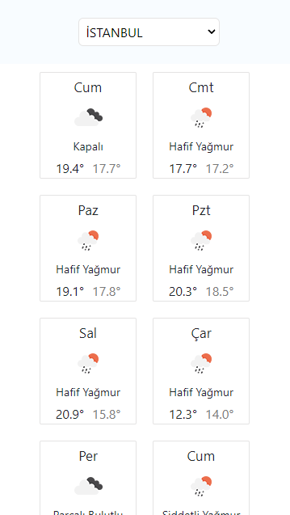

# Weather App

Weather App shows the next 7 days forecast, starting from the current day.

[Open Weather Map](https://openweathermap.org/api) - [One Call Api](https://openweathermap.org/api/one-call-api), get an api key and replace ./services/WeatherService.js -> const API_KEY = "YOUR API KEY";

## Desktop

## Mobile

## Available Scripts

In the project directory, you can run:

### `yarn start`

Runs the app in the development mode.\
Open [http://localhost:3000](http://localhost:3000) to view it in the browser.

The page will reload if you make edits.\
You will also see any lint errors in the console.
